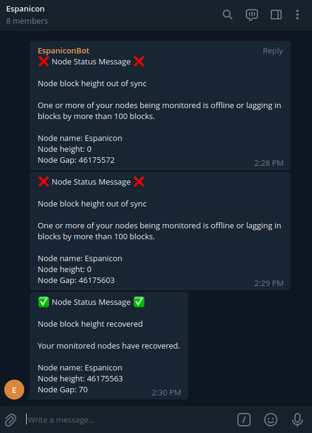
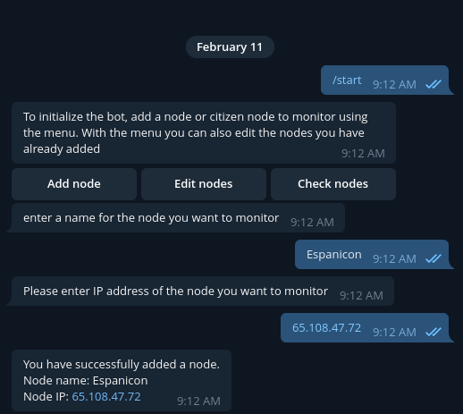

# Icon-node-monitor Bot

*Icon-node-monitor* is a bot intended to keep track of the status of a node (or list of nodes) in the ICON Network.

The bot has 3 main functions which are the following:
* A list of commands that can be used to check nodes you add to be monitored.
* Runs a recursive check every minute and in the case any of your nodes being behind the ICON Network block height for more than 100 blocks it sends a message to all the users (or chat groups) you add to the bot.
* Runs a recursive check every hour and verifies the goloop version of the nodes, in case any of the nodes being monitored is not running the latest version of goloop in the docker repositories it will also send an alert to the users (or chat groups) you added to the bot. This check can be stopped via bot commands.

The bot allows for a user to be the bot admin and has a lock/unlock state, if the bot is locked only the bot admin is allow to modify certain configurations (add/remove nodes to be monitored and users to the report list) and run certain commands (i.e stopping and starting the version check for the nodes).




To use the bot please follow the instructions in the **Install** section, this will allow you to configure your own monitor bot with a bot name you define.

We are running an instance of this bot in a private telegram group, if you are a Prep in the ICON Network you can also contact [@Espanicon_Prep](https://telegram.me/Espanicon_Prep) on telegram and we will add you to the group to use this instance of the bot that we are running so you don't have to run one in a server.

## How to use
To start using the bot, send the command `/start`, the bot will reply with a message asking you to add the nodes you would like to monitor and users to report in case the recursive checks notice that the nodes are lagging or running outdated versions of goloop.



After adding a node, you can use any of the bots commands. Currently the bot has the following commands (you can always send `/info` as a command to the bot to get the list of commands):
* `/start` => command used to initialize the bot.
* `/info` => replies with info about the bot.
* `/checkMonitoredNodesHeight` => replies with the block gap between the ICON chain and the nodes to be monitored.
* `/checkMonitoredAndBlockProducersHeight` => replies with the current block in the chain and the highest block for each block producer and your monitored nodes.
* `/checkBlockProducersHeight` => replies with the current block in the chain and the highest block for each block producer.
* `/updatePrepsList` => Updates the list of block producers to check (Preps).
* `/showListOfPreps` => Replies with a list of the block producers in the network (Preps).
* `/addMeToReport` => If the bot is unlocked the user that sends this command will be added to the report list.
* `/addGroupToReport` => If the bot has been added to a group and also made a moderator of the group, after sending this command the bot will add this group to the report list and will send alert messages to the group.
* `/unlock` => If the bot admin sends this command the bot will be unlocked and anyone that talks to the bot will be able to add/remove nodes from the monitored list and users from the report list, they will also be able to activate/deactivate the version check recursive task
* `/lock` => After receiving this command the bot will be locked, only the bot admin will be able to unlock it and make changes to the different configurations of the bot
* `/testReport` => this command sends a test message to all users in the report list
* `/showListOfMonitored` => Replies with the list of nodes being monitored
* `/summary` => Replies with a summary of all the nodes being monitored and users in the report list.
* `/versionCheck (start | stop | run)` => This command can be send with either 'start', 'stop' or 'run' flag. 'start' will activate the recursive check for the node goloop version (activated by default), 'stop' will deactivate the check and 'run' will immediately run a version check.

## Install
To run your own version of the bot locally you will need [nodejs](https://nodejs.org/en/download/) version 17.4.0 or newer.

Clone the project in a local folder and then run `npm install`.

You will need a bot authentication token from telegram, to get one you can follow [these instructions](https://core.telegram.org/bots).

Create a `.env` file inside the project folder. The content of this file should look like this:
```
BOT_TOKEN="YOUR_AUTHENTICATION_TOKEN"
```

In the `BOT_TOKEN` variable paste the authentication token you got from *BotFather*.

You can now run your own version of the bot locally with the command `npm run start`

### Running icon-node-monitor as a service on linux

The bot can also be configured to run as a service on a linux server, here is an [article explaining how to run **nodejs** applications as a service on linux](https://nodesource.com/blog/running-your-node-js-app-with-systemd-part-1/).

To summarize you need to create a `.service` (in this example the name is `icon-node-monitor.service`) file and copy the file to `/etc/systemd/system` folder. Here is a template that you can use for the `.service` file, modify the paths to fix your own configuration:

```
[Unit]
Description=Icon node monitor

[Service]
ExecStart=/usr/bin/node /home/{USER}/icon-node-monitor/index.js
Restart=on-failure
Environment=PATH=/usr/bin:/usr/local/bin
Environment=NODE_ENV=production
WorkingDirectory=/home/{USER}/icon-node-monitor
```

After that simply run `sudo systemctl icon-node-monitor.service` to run the bot in the background as a service.
## License

This project is licensed under the MIT License - see the [LICENSE](LICENSE) file for details

